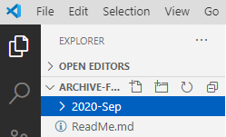
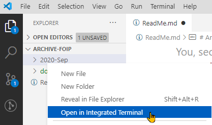

# Archive of Student Repositories

> This archive for **CPSC-1520** is maintained for FOIP use.

1. Create a folder in this repository with the name format of **`YYYY-MMM`** to place all the archived repositories for that school term.

    

1. Open the folder in the integrated terminal.

    

1. 